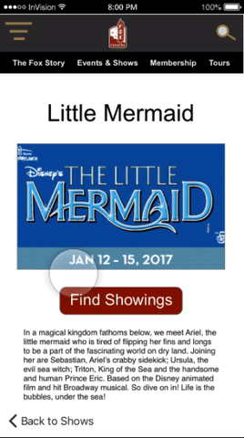

# foxRefresh
Refreshing the Fox Theater website for Mobile

##THE CHALLENGE

* Prioritize and design features that address users’ needs while satisfying the business prompt.  
* Work within the current service, design, and brand standards of the company and adapt those to work within the interface standards for either Android or iOS.

##WHAT TO EXPECT

###PROJECT REQUIREMENTS

* Apply all fundamental UX skills over a 2-week design process. 
* Every day we’ll explore a UX technique which will help you in your design process. 
* Every day there will be workshop time for you to apply these skills.
* Class time and workshop time is MANDATORY—any additional time you spend on making your project great is up to you.
* Take photos to document the steps of your design process.

###PROGRESSION

Sketches, Wireframes, First Clickable Prototype

###FIRST MVP

Ideas tossed to backlog: social aspect for Fox members to interact with each other. 

Try it out here:https://phamous2day.github.io/foxRefresh/

###AFTER MANY ITERATIONS, THIS IS THE FINAL MVP

Based off of many user research and user testing, we collected all the feedback and pain points and based the designs and navigation.

###TRY IT HERE
https://invis.io/RC9ZB93PM
